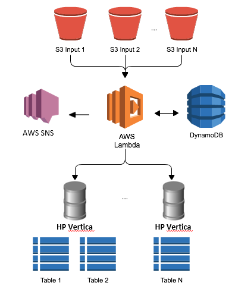

# A Zero Administration AWS Lambda Based HP Vertica Database Loader

Running your Vertica cluster(s) on AWS? Staging your source data files on S3?
If so, this automatic loader may be just the thing for you! It will automatically load your newly created S3 files into target tables in one or more vertica clusters. 

Here are some of the features it provides:
- match source files based on S3 bucket/folder and filename regex pattern
- control batching of new files (based on file count or time window)
- customise load using any of the many COPY options supported by Vertica (see [docs](http://my.vertica.com/docs/7.1.x/HTML/index.htm#Authoring/SQLReferenceManual/Statements/COPY/COPY.htm%3FTocPath%3DSQL%2520Reference%2520Manual%7CSQL%2520Statements%7CCOPY%7C_____0)). For example, you can:
	- use a [FlexZone parser](http://my.vertica.com/docs/7.1.x/HTML/index.htm#Authoring/FlexTables/FlexParsersReference.htm%3FTocPath%3DFlex%2520Tables%2520Guide%7CFlex%2520Parsers%2520Reference%7C_____0) to handle a variety of file formats
	- specify ON ANY NODE to balance parallel multi-file loads across the cluster
	- control load mode - use DIRECT to load bypass WOS when you know the batches are large
- simultaneously load the files to multiple clusters. For each cluster you can specify:
	- target table name (can be regular or Flex table)
	- Optional SQL statement to run before the load (e.g. truncate table, swap partitions, etc.) 
	- Optional SQL statement to run after the load (e.g. compute flex table keys and view, clean or transform data, etc.)
- subscribe to recieve notifications (by email or other delivery) letting you know which commands were run, and if everything worked, or not. 

The HP Vertica loader function runs within the AWS Lambda service. *[AWS Lambda](http://aws.amazon.com/lambda) provides an event-driven, zero-administration compute service. It allows developers to create applications that are automatically 
hosted and scaled, while providing you with a fine-grained pricing structure. With AWS Lambda you get automatic scaling, high availability, and built in Amazon CloudWatch Logging."* 

The code is based on the [Zero Administration AWS Based Amazon Redshift Loader](https://blogs.aws.amazon.com/bigdata/post/Tx24VJ6XF1JVJAA/A-Zero-Administration-Amazon-Redshift-Database-Loader) function, generously published by AWS under the [Amazon Software License](http://aws.amazon.com/asl/). The ["AWS-Lambda-Redshift-Loader" github repo](https://github.com/awslabs/aws-lambda-redshift-loader), was forked and modified to create the ["AWS-Lambda-Vertica-Loader" repo](https://github.com/rstrahan/aws-lambda-vertica-loader).
Thank you, AWS!

The architecture is fairly straightforward.
- [AWS S3](http://aws.amazon.com/s3) provides source file repository
- [AWS Lambda](http://aws.amazon.com/lambda) is used to run our Vertica Loader function when new files are added to S3
- [AWS DynamoDB](http://aws.amazon.com/dynamodb) is used to store load configurations (passwords are encrypted!), and to track status of batches and individual files
- [AWS SNS](http://aws.amazon.com/sns) (Simple Notification Service) is used to publish notifications for successful and failed loads. Users can subscribe to receive notifications by email.
- [HP Vertica](http://www.vertica.com/), of course, provides the massively scalable, feature loaded, simply fast data analytics platform that we all know and love!



## Instructions for getting started

### Step 1 - Prepare your HP Vertica Cluster(s)

#### Network access
Our function running within the AWS Lambda compute service, must be able to connect to your Vertica cluster as a JDBC client. In the future, per AWS, AWS Lambda will support presenting the service as though it was inside your own VPC, but for now your Vertica cluster must be reachable from any internet address, on tcp port 5433. 
You must configure your VPC / ACLs / Security Groups accordingly.

#### S3 bucket mounts
To enable Vertica to load files from an S3 bucket, the bucket must first be mounted to a path on the Vertica node's filesystem. 
To enable all cluster nodes to participate in parallel loading of a batch containing multiple files from an S3 bucket (*ON ANY NODE* option), the bucket must be mounted to the same path on all cluster nodes.

If you are using [Vertica-On-Demand](http://www.vertica.com/hp-vertica-products/ondemand/) then follow the VOD instructions for setting up S3 bucket access.

Otherwise, you will need to mount S3 buckets on each node, using the s3fs command.

The s3fs utiliy is pre-installed on cluster nodes built using the latest [HP Vertica AMI](https://aws.amazon.com/marketplace/pp/B00KY7A4OQ/ref=srh_res_product_title?ie=UTF8&sr=0-2&qid=1432228609686).  

If s3fs is not already installed on your Vertica nodes then you must install it to proceed: [directions](http://tecadmin.net/mount-s3-bucket-centosrhel-ubuntu-using-s3fs/)).

Once s3fs is installed, then set up your bucket mount on each node as follows:

1. Create the /etc/passwd-s3fs file containing your AWS access key id, and secret key, separated by a ':' on a single line. E.g.:
```
# sudo echo AWS_ACCESS_KEY_ID:AWS_SECRET_ACCESS_KEY > ~/.passwd-s3fs
# sudo chmod 600 ~/.passwd-s3fs
```
2. Create the mount point directory where we'll mount the bucket - /mnt/s3/<bucketname>
```
sudo mkdir -p /mnt/s3/<bucketname>
```
3. Add s3fs entry to /etc/fstab using your own bucket name.
```
s3fs#<bucketname>           /mnt/s3/<bucketname>        fuse    allow_other     0 0
```
4. And finally, mount the bucket
```
sudo mount -a
```

#### Database Tables and Users

You need to precreate the tables you will be loading. 

You can use a regular Vertica column store table, assuming you know the structure of the files that you will be loading. Verify that you have the columns all correctly specified with data types matching the columns in the incoming files.

Or, you can use a Flex table if you prefer. With flex tables, you don't need to specify the columns up front - Vertica will automatically determine the column structure from your data files (CSV headers, JSON keys, etc.), and can even add new columns on the fly. If you are not familiar with FlexZone, read some interesting blogs about it [here](http://www.vertica.com/tag/flexzone/). It is very cool - especially if the structure of your files is not known or can change. 

You might want to create a new Vertica user for our Lambda function to use. Give this user a complex password, and the minimum set of privileges necessary to load the table (and to run any pre or post load SQL statements that you intend to configure). Or, you could throw caution to the wind, and let Lambda connect as dbadmin. You decide.  

## Step 2 - Setup AWS Lambda Function

Create the Lambda function

1.	Go to the AWS Lambda Console in the same region as your S3 bucket and HP Vertica cluster.
2.	Select Create a Lambda function and enter the name MyVerticaDBLoader (for example).
3.	Under Code entry type select Upload a zip file and upload the [AWSLambdaVerticaLoader-1.0.0.zip](https://github.com/rstrahan/aws-lambda-vertica-loader/blob/master/dist/AWSLambdaVerticaLoader-1.0.0.zip) from the dist folder
4.	Use the default values of index.js for the filename and handler for the handler.
5.	Follow the wizard for creating the AWS Lambda Execution Role. NOTE: You will need IAM privileges to create a new role - you may need your AWS administrator to help with this step if you don't have the required access. Give your new role a sensible name, like 'Lambda_VerticaDB_Loader_Role' (for example). 
5.	Use the max timeout for the function - 60(s).

Configure a Lambda event source (delivers S3 PUT events to your AWS Lambda function)

1.	On your newly deployed function, select Configure Event Source and select the bucket you want to use for input data. Select 'Put' as the notification type.
2.	Click Submit to save the changes.

When you're done, you'll see that the AWS Lambda function is deployed and you 
can submit test events and view the CloudWatch Logging log streams.

## Step 3 - Edit the new AWS Lambda Execution Role

Add the IAM policy shown below to the role you (or your admin) created for Lambda in the previous step. If you followed my suggestion, this role will be called 'Lambda_VerticaDB_Loader_Role'. If you don't have IAM privileges, you will once again need to ask your AWS admin for help.

This policy will enable Lambda to call SNS, use DynamoDB, write Manifest 
files to S3, and perform encryption with the AWS Key Management Service:

```
{
    "Version": "2012-10-17",
    "Statement": [
        {
            "Sid": "Stmt1424787824000",
            "Effect": "Allow",
            "Action": [
                "dynamodb:DeleteItem",
                "dynamodb:DescribeTable",
                "dynamodb:GetItem",
                "dynamodb:ListTables",
                "dynamodb:PutItem",
                "dynamodb:Query",
                "dynamodb:Scan",
                "dynamodb:UpdateItem",
                "sns:GetEndpointAttributes",
                "sns:GetSubscriptionAttributes",
                "sns:GetTopicAttributes",
                "sns:ListTopics",
                "sns:Publish",
                "sns:Subscribe",
                "sns:Unsubscribe",
                "s3:Get*",
                "s3:Put*",
                "s3:List*",
                "kms:Decrypt",
                "kms:DescribeKey",
                "kms:GetKeyPolicy"
            ],
            "Resource": [
                "*"
            ]
        }
    ]
}
```

## Step 4 - (Optional) Create SNS Notification Topics
This function can send notifications on completion of batch processing. Using SNS, 
you can then receive notifications through email and HTTP Push to an application, 
or put them into a queue for later processing. You can even invoke additional Lambda
functions to complete your data load workflow using an SNS Event Source for another
AWS Lambda function. To receive SNS notifications for succeeded 
loads, failed loads, or both, create SNS Topics and take note of their Amazon Resource Notations (ARN). 

## Step 5 - Setup client machine, used for configuration and administration 

You will need a machine set up to run the setup and admin scripts. The instructions below assume you will use a RHEL/CentOS machine. You can use an AWS EC2 instance, or an on-premise machine - doesn't matter. 

Make sure git is installed, e.g. for RHEL/CentOS, do:
```
sudo yum install git 
```
Clone the aws-lambda-vertica-loade repo from github
```
git clone https://github.com/rstrahan/aws-lambda-vertica-loader.git
```
Install npm and required node.js packages (yes, the function is written in javascript)
```
sudo yum install npm
cd aws-lambda-redshift-loader
npm install
```
Install AWS Node.js SDK. 
```
npm install aws-sdk
```
Configure the SDK. The full instructions are [here](http://docs.aws.amazon.com/AWSJavaScriptSDK/guide/node-configuring.html), but as a minimum you just need to create a file *~/.aws/credentials* containing your AWS access key and secret key:
```
[default]
aws_access_key_id = AWS_ACCESS_KEY_ID
aws_secret_access_key = AWS_SECRET_ACCESS_KEY
```

In order to ensure communication with the correct AWS Region, you'll need to set 
an environment variable ```AWS_REGION``` to the desired location.

```export AWS_REGION=us-east-1```


## Step 6 - Finally! Entering the Configuration
Now you are ready to create a configuration which tells the function how and if files should be loaded from S3. 

Next, run the setup.js script by entering node setup.js. The script asks questions 
about how the load should be done, including those outlined in the setup appendix 
as the end of this document. 

All data used to manage the lifecycle of data loads is stored in DynamoDB, and 
the setup script automatically provisions the following tables:

* LambdaVerticaBatchLoadConfig - Stores the configuration of how files in an S3 input prefix should be loaded into Vertica.
* LambdaVerticaBatches - Stores the list of all historical and open batches that have been created. There will always be one open batch, and may be multiple closed batches per S3 input prefix from LambdaVerticaBatchLoadConfig.
* LambdaVerticaProcessedFiles - Stores the list of all files entered into a batch, which is also used for deduplication of input files.

*** IMPORTANT ***
The tables used by this function are created with a max read & write per-second rate
of 5. This means that you will be able to accomodate 5 concurrent file uploads
per second being managed by ALL input locations which are event sources to this
Lambda function. If you require more than 5 concurrent invocations/second, then 
you MUST increase the Read IOPS on the LambdaVerticaBatchLoadConfig table, and
the Write IOPS on LambdaVerticaBatches and LambdaVerticaProcessedFiles to the 
maximum number of files to be concurrently processed by all Configurations.

Also please NOTE that AWS Lambda only allows 100 concurrent function invocations
as of 17 Apr 2015, so more than 100 concurrent files will result in Lambda throttling
and there will NOT be any database load done, nor will CloudWatch logs be generated.

The database password will be encrypted by the Amazon Key Management Service. Setup will create a 
new Customer Master Key with an alias named `alias/LambaVerticaLoaderKey`.

You are now ready to go. Simply place files that meet the configured format into 
S3 at the location that you configured as the input location, and watch as AWS 
Lambda loads them into your Vertica Cluster. You are charged by the number 
of input files that are processed, plus a small charge for DynamoDB. You now have 
a highly available load framework which doesn't require you manage servers!

## Loading multiple Vertica Clusters concurrently
Run ```node addAdditionalClusterEndpoint.js``` to add new clusters into 
a single configuration. This will require you enter the vital details for the 
cluster including endpoint address and port, DB name and password, table name, load options, pre and post load statements.

## Viewing Previous Batches & Status
If you ever need to see what happened to batch loads into your Cluster, you can 
use the 'queryBatches.js' script to look into the LambdaVerticaBatches DynamoDB 
table. It takes 3 arguments:

* region - the region in which the AWS Lambda function is deployed
* status - the status you are querying for, including 'error', 'complete', 'pending', or 'locked'
* date - optional date argument to use as a start date for querying batches

Running ```node queryBatches.js us-east-1 error``` would return a list of all batches 
with a status of 'error' in the US East region.

You can use describeBatch.js to 
show all detail for a batch. It takes 3 arguments as well:

* region - the region in which the AWS Lambda function is deployed
* batchId - the batch you would like to see the detail for
* s3Prefix - the S3 Prefix the batch was created for

## Clearing Processed Files
We'll only load a file one time by default, but in certain rare cases you might 
want to re-process a file, such as if a batch goes into error state for some reason. 
If so, use the 'processedFiles.js' script to query or delete processed files entries. 
The script takes an 'operation type' and 'filename' as arguments; use -q to query 
if a file has been processed, and -d to delete a given file entry. An example of 
the processed files store can be seen below.
 
## Reprocessing a Batch
If you ever need to reprocess a batch - for example if it failed to load the required 
files for some reason - then you can use the reprocessBatch.js script. This takes 
the same arguments as describeBatch.js (region, batch ID & input location). The 
original input batch is not affected; instead, each of the input files that were 
part of the batch are removed from the LambdaVerticaProcessedFiles table, and 
then the script forces an S3 event to be generated for the file. This will be 
captured and reprocessed by the function as it was originally. Please note you 
can only reprocess batches that are not in 'open' status.

## Unlocking a Batch
It is possible, but rare, that a batch would become locked but not be being processed 
by AWS Lambda. If this were to happen, please use ```unlockBatch.js``` including 
the region and Batch ID to set the batch to 'open' state again.

## Changing your stored Database Password 
Currently you must edit the configuration manually in Dynamo DB to make changes.
If you need to update your Redshift DB Password then you can use the ```encryptValue.js``` script to encrypt
a value using the Lambda Vertica Loader master key and encryption context. 

To run:
```
node encryptValue.js <region> <Value to Encrypt>
```

This script encrypts the value with Amazon KMS, and then verifies the encryption is
correct before returning a JSON object which includes the input value and the
encrypted Ciphertext. You can use the 'encryptedCiphertext' attribute of this object
to update the Dynamo DB Configuration. 

## Ensuring Loads happen every N minutes
If you have a prefix that doesn't receive files very often, and want to ensure 
that files are loaded every N minutes, use the following process to force periodic loads. 

When you create the configuration, add a filenameFilterRegex such as '.*\.csv', which 
only loads CSV files that are put into the specified S3 prefix. Then every N minutes, 
schedule the included dummy file generator through a CRON Job. 

```./path/to/function/dir/generate-trigger-file.py <region> <input bucket> <input prefix> <local working directory>```

* region - the region in which the input bucket for loads resides
* input bucket - the bucket which is configured as an input location
* input prefix - the prefix which is configured as an input location
* local working directory - the location where the stub dummy file will be kept prior to upload into S3

This writes a file called 'lambda-vertica-trigger-file.dummy' to the configured 
input prefix, which causes your deployed function to scan the open pending batch 
and load the contents if the timeout seconds limit has been reached.

## Reviewing Logs
For normal operation, you won't have to do anything from an administration perspective. 
Files placed into the configured S3 locations will be loaded when the number of 
new files equals the configured batch size. You may want to create an operational 
process to deal with failure notifications, but you can also just view the performance 
of your loader by looking at Amazon CloudWatch. Open the CloudWatch console, and 
then click 'Logs' in the lefthand navigation pane. You can then select the log 
group for your function, with a name such as `/aws/lambda/<My Function>`.

Each of the above Log Streams were created by an AWS Lambda function invocation, 
and will be rotated periodically. You can see the last ingestion time, which is 
when AWS Lambda last pushed events into CloudWatch Logging.

You can then review each log stream, and see events where your function simply 
buffered a file, or where it performed a load.
 

# Configuration Reference

The following section provides guidance on the configuration options supported. 
For items such as the batch size, please keep in mind that in Preview the Lambda 
function timeout is 60 seconds. This means that your COPY command must complete 
in less than ~ 50 seconds so that the Lambda function has time to complete writing 
batch metadata. The COPY time will be a function of file size, the number of files 
to be loaded, the size of the cluster, and how many other processes might be consuming 
resource pool queue slots.

Item | Required | Notes
:---- | :--------: | :-----
Enter the Region for the Redshift Load Configuration| Y | Any AWS Region from http://docs.aws.amazon.com/general/latest/gr/rande.html, using the short name (for example us-east-1 for US East 1)
Enter the S3 Bucket & Prefix to watch for files | Y | An S3 Path in format <bucket name>/<prefix>. Prefix is optional
Enter a Filename Filter Regex | N | A Regular Expression used to filter files which appeared in the input prefix before they are processed.
Enter the Cluster Endpoint | Y | The Amazon Redshift Endpoint Address for the Cluster to be loaded.
Enter the Cluster Port | Y | The port on which you have configured your Amazon Redshift Cluster to run.
Enter the Database Name | Y | The database name in which the target table resides.
Enter the Database Username | Y | The username which should be used to connect to perform the COPY. Please note that only table owners can perform COPY, so this should be the schema in which the target table resides.
Enter the Database Password | Y | The password for the database user. Will be encrypted before storage in Dynamo DB.
Enter the Table to be Loaded | Y | The Table Name to be loaded with the input data.
Should the Table be Truncated before Load? (Y/N) | N | Option to truncate the table prior to loading. Use this option if you will subsequently process the input patch and only want to see 'new' data with this ELT process.
Enter the Data Format (CSV or JSON) | Y | Whether the data format is Character Separated Values or JSON data (http://docs.aws.amazon.com/redshift/latest/dg/copy-usage_notes-copy-from-json.html).
If CSV, Enter the CSV Delimiter | Yes if Data Format = CSV | Single character delimiter value, such as ',' (comma) or '|' (pipe).
If JSON, Enter the JSON Paths File Location on S3 (or NULL for Auto) | Yes if Data Format = JSON | Location of the JSON paths file to use to map the file attributes to the database table. If not filled, the COPY command uses option 'json = auto' and the file attributes must have the same name as the column names in the target table.
Enter the S3 Bucket for Redshift COPY Manifests | Y | The S3 Bucket in which to store the manifest files used to perform the COPY. Should not be the input location for the load.
Enter the Prefix for Redshift COPY Manifests| Y | The prefix for COPY manifests.
Enter the Prefix to use for Failed Load Manifest Storage | N | On failure of a COPY, you can elect to have the manifest file copied to an alternative location. Enter that prefix, which will be in the same bucket as the rest of your COPY manifests.
Enter the Access Key used by Redshift to get data from S3 | Y | Amazon Redshift must provide credentials to S3 to be allowed to read data. Enter the Access Key for the Account or IAM user that Amazon Redshift should use.
Enter the Secret Key used by Redshift to get data from S3 | Y | The Secret Key for the Access Key used to get data from S3. Will be encrypted prior to storage in DynamoDB.
Enter the SNS Topic ARN for Failed Loads | N | If you want notifications to be sent to an SNS Topic on successful Load, enter the ARN here. This would be in format 'arn:aws:sns:<region>:<account number>:<topic name>.
Enter the SNS Topic ARN for Successful Loads  | N | SNS Topic ARN for notifications when a batch COPY fails.
How many files should be buffered before loading? | Y | Enter the number of files placed into the input location before a COPY of the current open batch should be performed. Recommended to be an even multiple of the number of CPU's in your cluster. You should set the multiple such that this count causes loads to be every 2-5 minutes.
How old should we allow a Batch to be before loading (seconds)? | N | AWS Lambda will attempt to sweep out 'old' batches using this value as the number of seconds old a batch can be before loading. This 'sweep' is on every S3 event on the input location, regardless of whether it matches the Filename Filter Regex. Not recommended to be below 120.
Additional Copy Options to be added | N | Enter any additional COPY options that you would like to use, as outlined at (http://docs.aws.amazon.com/redshift/latest/dg/r_COPY.html). Please also see http://blogs.aws.amazon.com/bigdata/post/Tx2ANLN1PGELDJU/Best-Practices-for-Micro-Batch-Loading-on-Amazon-Redshift for information on good practices for COPY options in high frequency load environments.

----

Copyright 2014-2015 Amazon.com, Inc. or its affiliates. All Rights Reserved.

Licensed under the Amazon Software License (the "License"). You may not use this file except in compliance with the License. A copy of the License is located at

	http://aws.amazon.com/asl/

or in the "license" file accompanying this file. This file is distributed on an "AS IS" BASIS, WITHOUT WARRANTIES OR CONDITIONS OF ANY KIND, express or implied. See the License for the specific language governing permissions and limitations under the License.
